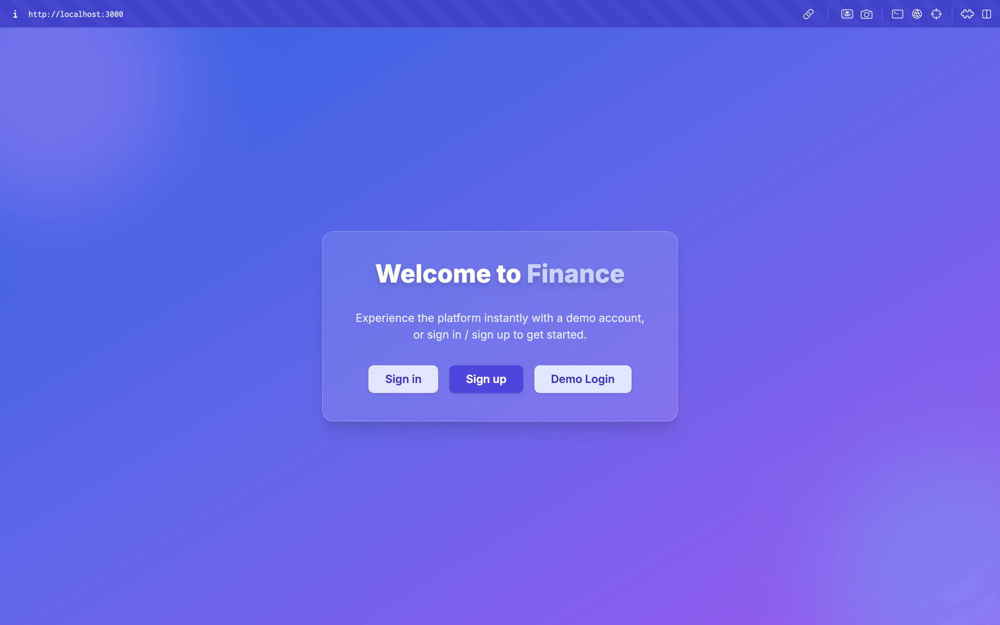

# Finance




This is a **Finance Platform** project developed using [Next.js 14](https://nextjs.org/) and React 18.  
A modern finance dashboard for managing personal finances, tracking transactions, and visualizing data through interactive charts.

---

## Main Features

- Built with Next.js 14 (App Router)
- Data validation with Zod
- Authentication UI (Clerk, frontend only)
- Interactive overview with charts
- Changeable chart types (bar, line, pie, etc.)
- Account and date filters
- Custom React forms
- CSV file import (frontend mock)
- Styled with Tailwind CSS and Shadcn UI
- All data is managed in local state
- Sample/mock data for transactions, categories, and charts
- Ready for frontend demos and prototyping

---

## Technologies Used

-  Next.js 14
-  React 18
-  Tailwind CSS
- Shadcn UI
- Zod (validation)
- Clerk (authentication UI, frontend only)

---

## How to Run

First, install dependencies:

```bash
npm install
# or
yarn
# or
pnpm install
```

Then, run the development server:

```bash
npm run dev
# or
yarn dev
# or
pnpm dev
# or
bun dev
```

Open [http://localhost:3000](http://localhost:3000) in your browser to see the result.

---

## Demo

[Live Demo](https://finance-platform-mauve.vercel.app/)

---

### Screenshots


---

## Details

- All application data is managed entirely in local React state, ensuring a fast and responsive user experience.
- No backend, database, or external API dependencies—everything runs seamlessly in the browser.
- Interactive charts and overviews are powered by dynamic sample/mock data for clear financial insights and engaging demos.
- Users can intuitively add, edit, and delete transactions, accounts, and categories directly in the UI (with changes reflected instantly; data resets on reload for demo purposes).
